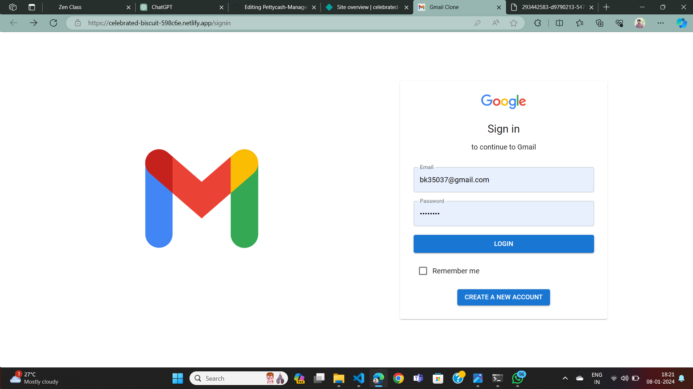
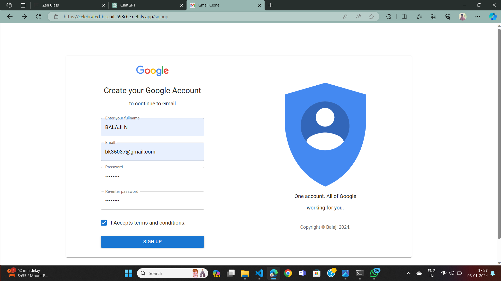
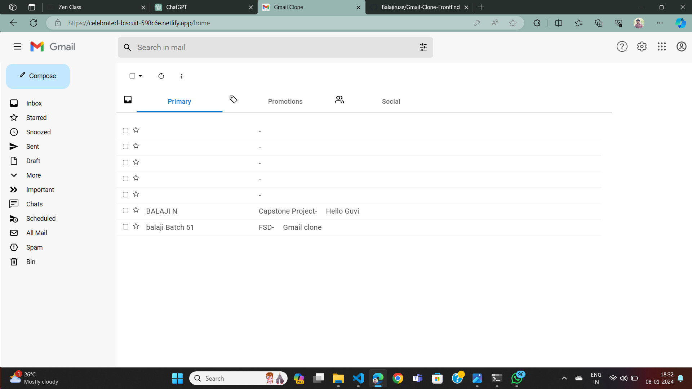

## Hello

# Gmail Clone

This project aims to replicate the basic functionalities of Gmail, providing a platform for users to send, receive, organize, and manage emails.

## Features

- User Authentication
- Compose Emails
- Inbox
- Sent Mail
- Drafts
- Search

## Technologies Used

- MongoDB, Express.js, React.js, Node.js (MERN stack)
- Redux for state management
- React Router for routing
- Formik and Yup for form handling and validation
- JSON Web Tokens (JWT) for user authentication

### Installation

1. Clone the repository
2. open terminal
3. cd{Folder name}
4. npm run dev
5. Ctrl+Click the link to open the Website

## Images

### deployed Link 
[Click to open](https://celebrated-biscuit-598c6e.netlify.app/signin)

## Contact

- [GitHub](https://github.com/balajiruse)
- [LinkedIn]()

Happy coding! 🚀
